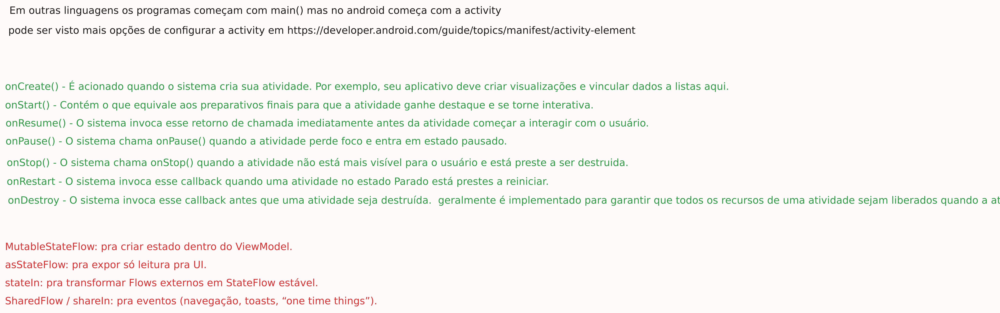

# 🦇 **Understanding Android Activity Lifecycle, launchModes, Deep Links, and Intent Handling**

## 📌 Overview

This mini-project explores some of the most misunderstood — and most powerful — behaviors in the Android activity system:

* **How Activities are launched and reused**
* **How launch modes affect Activity instances**
* **How to handle input from different Intent sources**
* **How deep links work**
* **How ACTION_SEND interacts with your app**
* **How to use `onNewIntent()` to update an existing Activity**
* **How to integrate all of this with Jetpack Compose**

The goal was to build a single `ReceiverActivity` that can be opened by:

* a **deep link**
* an **ACTION_SEND** (share intent)
* and **reuse itself** without creating duplicate instances
* **while updating the UI with new data**



## 🧠 What This Project Demonstrates

### ### 1. Activity launch modes

Android allows you to control how Activities behave when new Intents target them.

In this project, we used:

### **`singleTop`**

```
If the Activity is already at the top of the task:
→ it will NOT be recreated
→ instead, onNewIntent() is called
```

This is perfect for Activities that need to:

* receive new data multiple times
* update their UI without recreating the entire screen
* avoid multiple instances being pushed on the back stack

## 🌐 2. Deep Link Handling

We configured Android to open our `ReceiverActivity` when a user opens a URL like:

```
https://harukadev.com/blog?id=10
```

Manifest configuration:

```xml
<intent-filter>
    <action android:name="android.intent.action.VIEW" />
    <category android:name="android.intent.category.DEFAULT" />
    <category android:name="android.intent.category.BROWSABLE" />
    <data
        android:scheme="https"
        android:host="harukadev.com"
        android:pathPrefix="/blog" />
</intent-filter>
```

This allows the Activity to be launched from:

* Chrome
* external browsers
* ADB
* emails
* other apps

## 📩 3. Handling ACTION_SEND

Our Activity also accepts text shared from other apps:

```xml
<intent-filter>
    <action android:name="android.intent.action.SEND" />
    <category android:name="android.intent.category.DEFAULT" />
    <data android:mimeType="text/plain" />
</intent-filter>
```

This allows:

* sending text from inside the app using `Intent.ACTION_SEND`
* receiving text from external apps via the share sheet

## 🔁 4. Handling New Data with `onNewIntent()`

When the Activity uses `launchMode="singleTop"`, new Intents don’t recreate the Activity.
Instead:

```kotlin
override fun onNewIntent(intent: Intent?) {
    super.onNewIntent(intent)
    setIntent(intent)
    handleIntent(intent)
}
```

This allows the Activity to:

* **remain alive**
* **update the UI with new deep-link parameters or shared text**

## 🧪 5. Testing Deep Links with ADB

To test implicit deep-links:

```bash
adb shell am start \
  -a android.intent.action.VIEW \
  -c android.intent.category.BROWSABLE \
  -d "https://harukadev.com/blog?id=10"
```

To force-launch the Activity explicitly (bypassing intent filters):

```bash
adb shell am start \
  -n "com.harukadev.studyinglifecycle/.ReceiverActivity" \
  -a android.intent.action.VIEW \
  -d "https://harukadev.com/blog?id=10"
```

## 🧩 6. Behavior Summary

| Trigger                                   | Result                                         |
|-------------------------------------------|------------------------------------------------|
| Deep link opened while Activity is closed | Activity is created, UI shows deep-link data   |
| Deep link opened while Activity is OPEN   | Activity is reused (`onNewIntent`), UI updates |
| ACTION_SEND used while Activity is closed | Activity is created with shared text           |
| ACTION_SEND used while Activity is OPEN   | Activity is reused, UI updates                 |
| Opening Activity directly                 | Works normally, without duplicates             |

## 🦋 Final Notes

This project is a practical exploration of how Android handles multiple Activity entry points.
It demonstrates:

* How to avoid duplicate Activity instances
* How to correctly handle new Intents
* How to combine multiple sources of data (share + deep link)
* How to integrate all of this with Jetpack Compose

Mastering these behaviors gives you control over:

* App navigation
* Multi-tasking interactions
* Share actions
* External links
* Notification taps
* PendingIntents
* And more